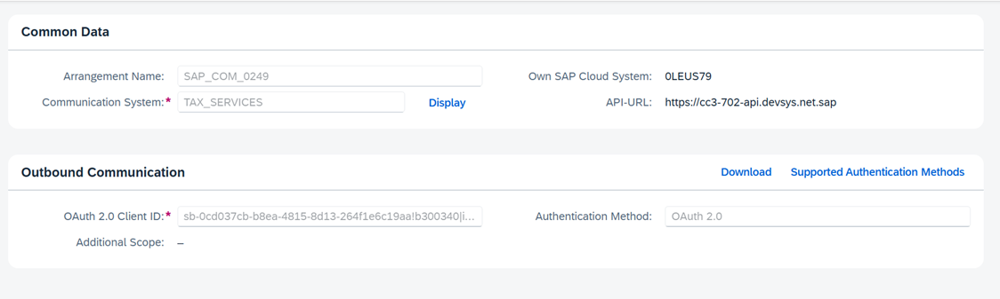

# Communication Setup

**Application Component:**  
**Release:**  
**Author:** Bhavik, Amaresh, Vageesha  

## POC Documentation:
Communication arrangement for External Tax Engine  

---

## History

| Version | Status (With Comments) | Reviewed By/Date |
|---------|------------------------|------------------|
| 1.0     | Draft                  |                  |

---

## Contents

1. [Introduction of Iflow](#introduction-of-iflow)  
2. [Communication Setup](#communication-setup)  
   - [Key Elements of Communication Setup](#key-elements-of-communication-setup)  
   - [Importance of Communication Setup](#importance-of-communication-setup)  
   - [Communication Scenarios](#communication-scenarios)  
   - [Communication System](#communication-system)  
   - [Communication Arrangement](#communication-arrangement)  
   - [Block Diagram](#block-diagram)  
3. [Analysis of Brazil Solution](#analysis-of-brazil-solution)  
   - [Brazil Iflow Ovreview](#brazil-iflow-overview)  
   - [Communication Scenarios used by Brazil](#communication-scenarios-used-by-brazil)  
   - [Communication Arrangement used by Brazil](#communication-arrangement-used-by-brazil)  
   
4. [Testability](#testability)  
   - [Iflow](#iflow)
   - [Testing Details](#testing-details)

---

## Introduction of Iflow

In SAP, an **integration Flow (Iflow)** is a graphical model that represents an integration scenario. It contains endpoints and flow steps and is used to process integration. The SAP **CPI-PI IFlow** operator provides the possibility to trigger IFlow in an SAP CPI system. It calls the set CPI system, sending the received input data (assumed as JSON) as payload. The response is emitted via the outbound port. Currently, only **HTTP Basic Authentication** is supported.

Iflows can be easily [designed](https://developers.sap.com/tutorials/cp-starter-integration-cpi-design-iflow.html) in just a few steps with the help of the **Integration Suite** in the Business Technology Platform.

For the **External Tax Engine**, there is a [generic](https://api.sap.com/integrationflow/Request_Tax_Calculation_for_Single_Engine) SAP-delivered Iflow in place, which can be reused for any country.

### Generic IFlow Diagram  
  

### Authentication Methods:
1. **Direct communication** between partners and SAP supports **OAuth2.0** as an authentication method, defined in the **Outbound Service** linked to **Communication Scenario SAP_COM_0249**.
2. **Customers can use other authentication methods** with CPI. The IFlow uses **OAuth2.0** for authentication in **SAP_COM_0249**. However, through IFlow, you can set any authentication method to communicate with Partner API endpoints.

---

## Communication Setup

A **communication setup** in SAP defines how SAP systems or external applications communicate. It includes:
- **Hostnames**
- **Ports**
- **User credentials**
- **Communication protocols**  

These are managed through **communication arrangements** within SAP.

### Key Elements of a Communication Setup
1. **Communication System** – Represents an external system with its technical details.
2. **Communication User** – A technical user for authentication and authorization.
3. **Communication Arrangement** – Defines which communication system can access which communication scenarios.
4. **Communication Scenario** – A predefined set of rules for data exchange between systems.

---

### Importance of Communication Setup

- **Integration with External Systems** – SAP can exchange data with CRM, ERP, or third-party services.
- **Data Replication** – Seamless data transfer across SAP environments.
- **Workflow Automation** – Enables automated processes based on system events.

---

## Communication Scenarios

A **communication scenario** bundles inbound and outbound communication design-time artifacts. Since it enables communication between systems, each **communication arrangement** must be based on a **communication scenario**. For all standard APIs, SAP S/4HANA provides predefined communication scenarios. 

### Typical Communication Scenario Diagram  
 

 

---
## Communication System

### Steps to Create a Communication System:
1. Log in to the **SAP Fiori launchpad**.
2. Navigate to the **Communication Systems** app.
3. Click **New**.
4. Enter:
   - **System ID** (e.g., `TAX_SERVICES`)
   - **System Name**
5. Click **OK**.
6. Enter the **host name**.
7. Provide a **Logical System** entry.
8. In **Users for Outbound Communication**, click **Add** to create a new communication user.

### Communication System Configuration Screenshot  

    

---

## Communication Arrangement

To allow outbound communication to an SAP S/4HANA tenant, a **communication arrangement** must be created.

### Steps to Create a Communication Arrangement:
1. Log in to the **SAP Fiori launchpad**.
2. Navigate to the **Communication Arrangements** app.
3. Click **New**.
4. Select the (`SAP_COM_0249`).
5. Modify the **Arrangement Name** if needed.
6. Click **Create**.
7. Under **Common Data**, select the **Communication System** created (`TAX_SERVICES`).
8. Save changes and ensure the arrangement is **Active**.

### Communication Arrangement Screenshot  
  
 

---

## Block Diagram

Below is a high-level representation of the communication setup:

+-------------------+        +-------------------+          +---------------------+ 
| SAP S/4HANA Cloud| --->    | SAP Cloud Platform| --->     | External Tax Engine | 
| (Communication   |         |                   |          |                     |
|  Arrangement)    |         | Integration (CPI) |          | (Vertex/Avalara)    |
|                  |         |  Middleware       |          |                     |
+-------------------+        +-------------------+          +---------------------+ 

- **SAP S/4HANA Cloud**: Sends outbound requests via communication arrangement.
- **SAP CPI**: Middleware that routes and transforms messages.
- **External Tax Engine**: Receives requests, processes tax calculations, and returns responses.

  

---

## Analysis of Brazil Solution

Brazil **reused the generic IFLOW** of the **External Tax Engine**. It exposes its own services specific to Brazil.

  

### Brazil IFlow Overview

Brazil has created their own services(api) which is consumed by this generic IFLOW. The schema for api can be found [here](https://api.sap.com/api/taxquote_brazil/overview).

### Communication Scenario
•	Brazil has created a communication scenario SAP_COM_0249 with outbound service which is a http post request SAP_COM_0249_0001_REST . The outbound service supports oAuth 2.0 authentication.

### Communication System
• Now after exposing this communication scenario, there is a communication system defined as well which is called TAX_SERVICES and is used in the communication arrangement: SAP_COM_0249.

•	In the communication system TAX_SERVICES: The host of the system with which we want to communicate or to which we will send the outbound request is defined which in this case is hosted on this url: integration-s4-to-tax-engines-zhl9bos4.it-accd003-rt.cfapps.eu12.hana.ondemand.com. 
Authentication method used by this system is also oauth.

### Communication Arrangement
•Now finally the communication arrangement is defined which is SAP_COM_0249. This uses the communication system TAX_SERVICES (outbound requests being sent) and hit the outbound service on this path integration-s4-to-tax-engines-zhl9bos4.it-accd003-rt.cfapps.eu12.hana.ondemand.com/http/cpi/quote. The request is sent from SAP S/4HANA to SAP Cloud Integration (CPI), which acts as a middleware to process and forward the request.  The endpoint /http/cpi/quote handles tax calculation or quote retrieval from the external tax engine.

#### Dynamic Selection of Endpoint  
Dynamic selection of Endpoint in CPI used in Request Tax Calculation for Single External Engine. In HTTP address is assigned to <define_value> which is dynamically determined with the configuration maintained by partner. 

## In Summary:
Brazil created its own **APIs**, which are consumed by the **generic IFLOW**.

- **Communication Scenario**: `SAP_COM_0249`
- **Outbound Service**: `SAP_COM_0249_0001_REST`  
  - Authentication: **OAuth 2.0**
- **Communication System**: `TAX_SERVICES`  
  - **Host**: `integration-s4-to-tax-engines.example.com`
  - **Authentication**: OAuth

The **Communication Arrangement** (`SAP_COM_0249`) uses this system to send **outbound requests** via:  
`/http/cpi/quote`

SAP S/4HANA sends requests to SAP **Cloud Integration (CPI)**, which acts as middleware.

### Reference Document  
Refer to [Setting up Cloud Integration with external Tax engine](link-placeholder) for detailed configuration steps.

---

## Testability

### Iflow Details

- **Package:** `Z_EXTERNAL_TAX_CALCULATION`
- **Artifact:** `ZExternalTaxEngine`

### Testing Details

| System  | Report Name | Outbound Service | Communication Scenario | Communication System | Communication Arrangement |
|---------|------------|------------------|------------------------|----------------------|-------------------------|
| C50 (Tax Register) | `ZCOMM_SCENARIO_TEST` | `ZTAXREG_DTI_REST` | `ZTAXREG_COMMSCENARIO` | `ZIFLOWSYS` | `ZexternalIflow` |

---
