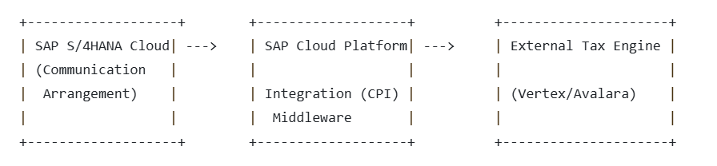
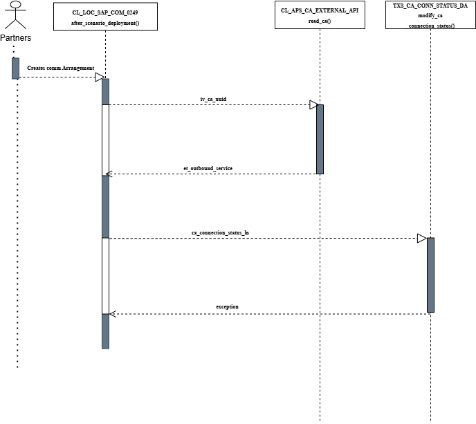

# Communication Setup

**Application Component:**  
**Release:**  
**Author:** Bhavik, Amaresh, Vageesha  

## POC Documentation:
Communication arrangement for External Tax Engine  

---

## History

| Version | Status (With Comments) | Reviewed By/Date  |
|---------|------------------------|------------------ |
| 1.0     | Draft                  | Robin P/13-02-2025|
|                                                      |
| 1.1     | Draft                  |                   |

---

## Contents

1. [Analysis of Brazil Solution](#analysis-of-brazil-solution)  
   - [Block Diagram](#block-diagram)
   - [Brazil Iflow Ovreview](#brazil-iflow-overview)  
   - [Communication Scenarios used by Brazil](#communication-scenarios-used-by-brazil)  
   - [Communication Arrangement used by Brazil](#communication-arrangement-used-by-brazil)  

2. [Scope](#Scope)
   
3. [Building Blocks of Communication](#building-blocks-of-communication)  
   - [Class Diagram](#class-diagram)
   - [Sequence Diagram](#sequence-diagram) 

4. [Testability](#testability) 
  - [IFLOW](#iflow)
  - [Testing Details](#testing-details)

5. [Conclusion](#conclusion)

---

## Analysis of Brazil Solution
### Block Diagram

Below is a high-level representation of the communication setup:

 

- **SAP S/4HANA Cloud**: Sends outbound requests via communication arrangement.
- **SAP CPI**: Middleware that routes and transforms messages.
- **External Tax Engine**: Receives requests, processes tax calculations, and returns responses.

  

Brazil **reused the generic IFLOW** of the **External Tax Engine**. It exposes its own services specific to Brazil.

  

### Brazil IFlow Overview

Brazil has created their own services(api) which is consumed by this generic IFLOW. The schema for api can be found [here](https://api.sap.com/api/taxquote_brazil/overview).

### Communication Scenario
•	Brazil has created a communication scenario SAP_COM_0249 with outbound service which is a http post request SAP_COM_0249_0001_REST . The outbound service supports oAuth 2.0 authentication.

### Communication System
• Now after exposing this communication scenario, there is a communication system defined as well which is called TAX_SERVICES and is used in the communication arrangement: SAP_COM_0249.

•	In the communication system TAX_SERVICES: The host of the system with which we want to communicate or to which we will send the outbound request is defined which in this case is hosted on this url: integration-s4-to-tax-engines-zhl9bos4.it-accd003-rt.cfapps.eu12.hana.ondemand.com. 
Authentication method used by this system is also oauth.

### Communication Arrangement
•Now finally the communication arrangement is defined which is SAP_COM_0249. This uses the communication system TAX_SERVICES (outbound requests being sent) and hit the outbound service on this path integration-s4-to-tax-engines-zhl9bos4.it-accd003-rt.cfapps.eu12.hana.ondemand.com/http/cpi/quote. The request is sent from SAP S/4HANA to SAP Cloud Integration (CPI), which acts as a middleware to process and forward the request.  The endpoint /http/cpi/quote handles tax calculation or quote retrieval from the external tax engine.

#### Dynamic Selection of Endpoint  
Dynamic selection of Endpoint in CPI used in Request Tax Calculation for Single External Engine. In HTTP address is assigned to <define_value> which is dynamically determined with the configuration maintained by partner. 

## In Summary:
Brazil created its own **APIs**, which are consumed by the **generic IFLOW**.

- **Communication Scenario**: `SAP_COM_0249`
- **Outbound Service**: `SAP_COM_0249_0001_REST`  
  - Authentication: **OAuth 2.0**
- **Communication System**: `TAX_SERVICES`  
  - **Host**: `integration-s4-to-tax-engines.example.com`
  - **Authentication**: OAuth

The **Communication Arrangement** (`SAP_COM_0249`) uses this system to send **outbound requests** via:  
`/http/cpi/quote`

SAP S/4HANA sends requests to SAP **Cloud Integration (CPI)**, which acts as middleware.

### Reference Document  
Refer to [Setting up Cloud Integration with external Tax engine](https://api.sap.com/odata/1.0/catalog.svc/Files('107589c0f80a4d479b54c56458b249f0')/$value) for detailed configuration steps.

---

## Scope
B3D, 1J5, 43D

---

## Building blocks of communication

### Class Diagram

#### Communication Deployment
 

#### Communication Consumption
 

---
### Sequence Diagram

#### Communication Deployment

#### Communication Consumption

---

## Testability

### Iflow

Package: Z_EXTERNAL_TAX_CALCULATION
Artifact: ZExternalTaxEngine

### Testing details:
System	C50(Tax Register)
Report name	ZCOMM_SCENARIO_TEST
Outbound Service	ZTAXREG_DTI_REST
Communication Scenario	ZTAXREG_COMMSCENARIO
Communication System	ZIFLOWSYS
Communication Arrangement	ZexternalIflow

---

## Conclusion

- We can reuse the existing brazil communication scenario which is using the iflow as we did not find any localized code for the communication
arrangement in the identified classes.
- Direct Communication can be done through communication arrangement of the partner system.
- Multiple partners can communicate via CPI using the communication arrangement delivered by SAP.
